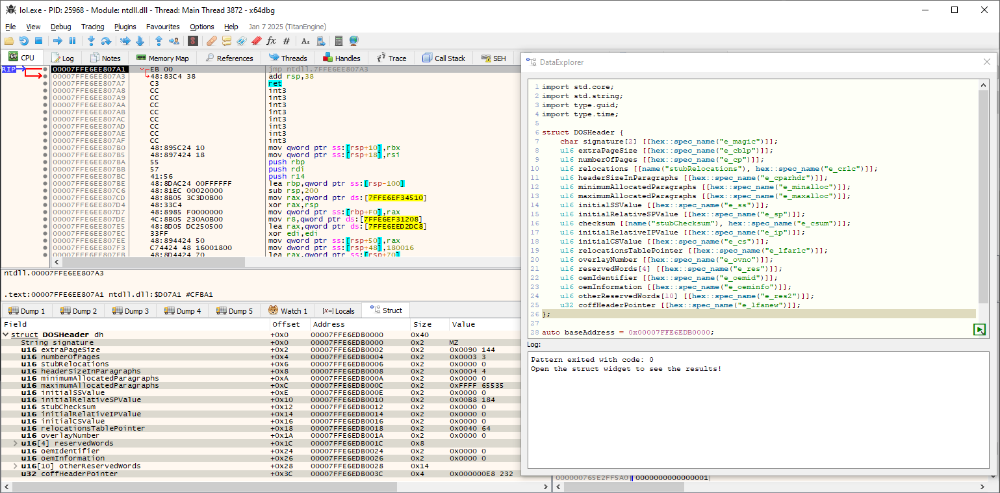

# DataExplorer

The DataExplorer plugin integrates the [pattern language](https://docs.werwolv.net/pattern-language) from [ImHex](https://imhex.werwolv.net/) into [x64dbg](https://x64dbg.com).



## Installation

- Download the [latest release](https://github.com/x64dbg/DataExplorer/releases/latest)
- Install the plugin so you have:
  ```
  <x64dbg-dir>/x64/plugins/DataExplorer/DataExplorer.dp64
  ```
- Launch x64dbg and open the plugin via `Plugins -> DataExplorer -> Open` (Ctrl+Shift+D)

**Note**: There is no 32-bit support and it is not planned.
